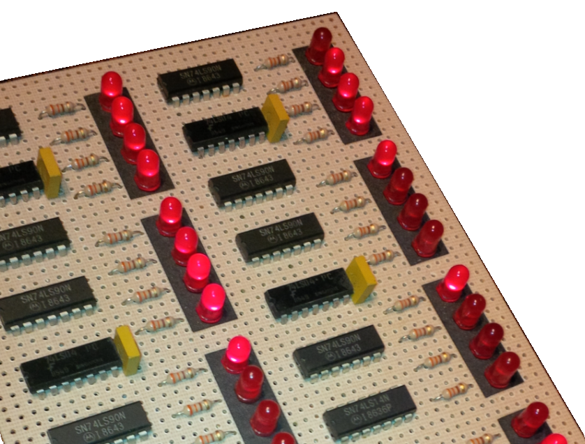

# ice-chips-verilog

[![Software License][ico-license]](LICENSE)
[![Language][ico-language]](source-7400)

[topdesc]: #desc
I'm focusing on the 74xx family: devices that were TTL originally (bipolar technologies such as LS, AS), that are now implemented as CMOS (HC, HCT, LV or many other technology variations)

#### Index
> [Devices by type and name](device-index.md)

#### Who
> Hobbyist who wants to program an FPGA, or do general digital circuit simulation, and wants to do it from already-proven building blocks

#### What
> Basic logic such as gates, registers, multiplexers, counters, adders, but also non-retriggerable monostable multivibrators

#### Why
> I noticed the [74xx chips][link-wiki7400] do not exist in one place as an open-source catalogue in Verilog (or in VHDL to my knowledge). To see them and create a simulation with them, you would need to open up Xilinx Vivado or ISE or the Intel/Altera Quartus IDE. You can find free [simulators and digital playgrounds][link-websim], but what to type into them? You'll need [IceChips](source-7400).

...Of course you could just buy a breadboard and the ICs. But that's going by different logic.



## What to Expect

* Each device validated by test bench
* Implemented formally: A single Input/Output/Code template; industry pin names; consistent Verilog
* Fully parametrized (so you could pretend that a quad or a hex buffer/line driver is actually 64 bits for your FPGA design; you could turn a triple 3-input NAND gate - the workhorse [7410](source-7400/7410.v) - into a heptal 5-input NAND gate just by plugging in the two numbers)

> Coming soon in 2019: As you see, the sequential devices are being worked on (counters etc.), with tri-state capability being worked on as we speak.

> Please contact me if you have a request (and the device number is less than about 74699!)

## Purpose

Using one module per logic device (in other words: encapsulated Verilog) promotes compositional design and bottom-up design so that hopefully large logic blocks/cores (from a crypto accelerator, or a [coin mining][link-coinmining] FPGA, to a CPU?) can be created if you validate and spec out each module, step by step. All you need to do is wire the modules together!

> Stay tuned because exciting things will happen once the library is built out more!

## Usage
[usage]: #usage

The test benches can be run using the open-source simulator Icarus Verilog: [Installation][link-iverilogi], [Getting Started][link-iverilogs].

With it installed on your system you can run a command like the following that specifies the required input files and one output file (.vvp):
```
> iverilog -g2012 -o 7400-tb.vvp ../includes/helper.v ../includes/tbhelper.v 7400-tb.v 7400.v
```

It then requires a second step: Run the Icarus Verilog simulator/runtime to see the tests run, with results logged to the console:
```
> vvp 7400-tb.vvp
```

If you're interested in looking even closer, the above vvp run stores signal and timing data of all the inputs, outputs, and the connection paths in the .vcd file, so run GTKWave viewer to see it all as a waveform: [Installation][link-gtkwavei], [Getting Started][link-gtkwaves].

With GTKWave installed, just click on the .vcd file to open.


## Acknowledgments

Coming soon.

## <!-- -->

© 2018-2019 Tim Rudy

[ico-license]: https://img.shields.io/badge/license-GPL--3.0%2B-blue.svg
[ico-language]: https://img.shields.io/badge/Verilog-100%25-orange.svg

[link-wiki7400]: https://en.wikipedia.org/wiki/List_of_7400_series_integrated_circuits
[link-websim]: https://www.google.com/search?q=free+web+verilog+editor+simulator
[link-coinmining]: http://whattomine.com
[link-iverilogi]: http://iverilog.wikia.com/wiki/Installation_Guide
[link-iverilogs]: http://iverilog.wikia.com/wiki/Getting_Started
[link-gtkwavei]: http://gtkwave.sourceforge.net
[link-gtkwaves]: http://iverilog.wikia.com/wiki/GTKWAVE
