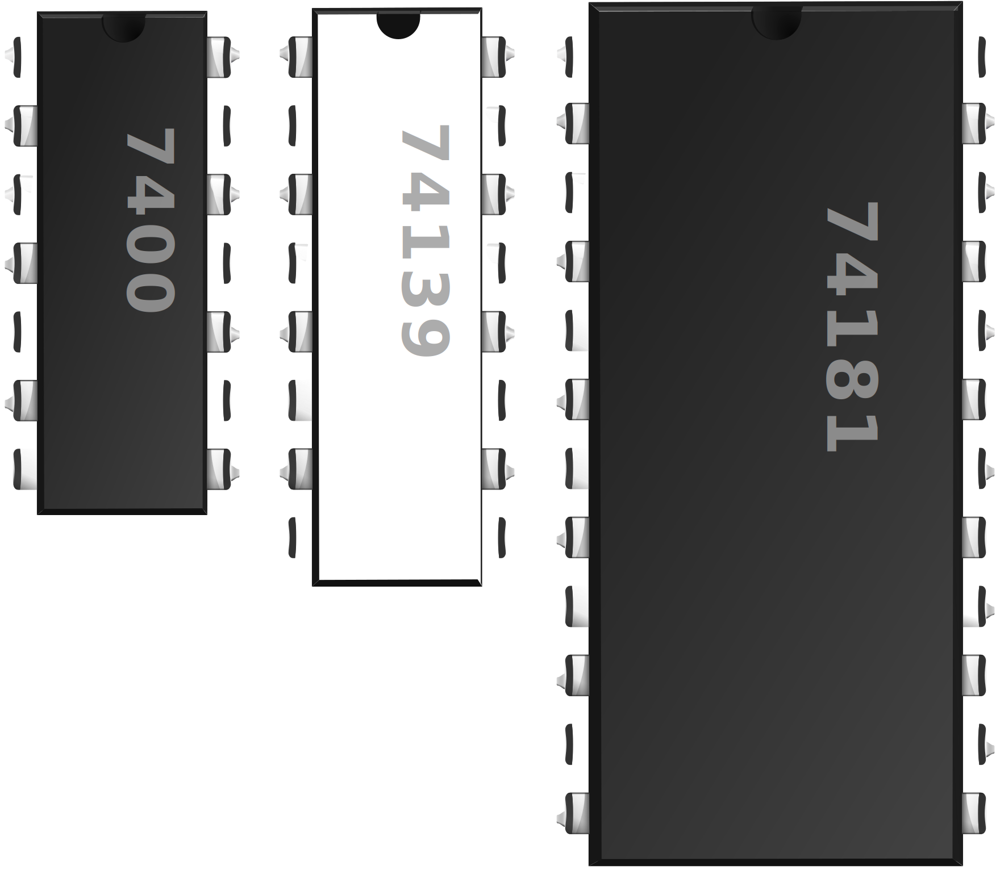
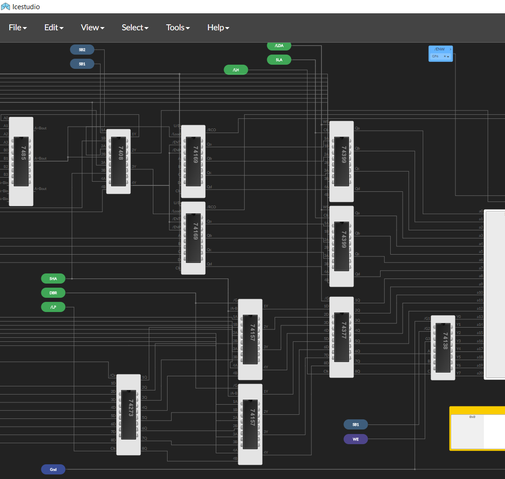

 
 

# ice-chips-verilog

[![Build/Test Status][ico-workflow-status]][link-workflow]

The 74LS, 74HC, 74HCT family of chips in Verilog for Electronic Design Automation

&ensp;&ensp;Fully validated by test bench · Parametrized code · DELAY parameters for timing simulation

IceChips is built to support the [Icestudio][link-icestudio] and [FPGAwars][link-fpgawars] manifesto:

&ensp;&ensp;&lt;Open Hardware driven by Open Source&gt;

## Getting Started

The easiest way to use these devices is [download the collection](../../releases/latest) and open it in the Icestudio design environment.

In Icestudio, go to `Tools > Collections > Add` and select the downloaded .zip file. Place and wire up your components, run and test the result. There's a variety of ways to provide inputs and view outputs; but no need for actual parts, wires or power supply.

Alternatively, you can download an individual device ([74xx.v file](source-7400/74153.v)) and use it in your own simulation in Verilog. This is the way to go if you wish to set the parameters for # bits, # inputs per gate, # blocks in a device.

See the Index to browse devices.

## Index

&ensp;&ensp;[Devices by type and name](device-index.md)

> ##### What are the 7400-series TTL chips?
>
> They're digital logic: Gates, multiplexers, counters, registers, adders, multipliers and more. See [Wikipedia full list][link-wiki-7400].

## Icestudio Design Flow

Welcome to virtual breadboarding.

Icestudio provides circuit simulation (for digital circuits) that's arbitrarily scalable. Explore, build and create, but most importantly, get near-instant feedback in testing your real hardware design. Each time you add a new input or a gate, or an LED, hit "Build" and "Upload". In the parlance of a silicon fab, you've gone through a "spin". But you're actually programming a reusable and fairly inexpensive FPGA.

&ensp;&ensp;CAD-style layout using drag & drop 
&ensp;&ensp;&ensp;&ensp;-> Full Verilog model 
&ensp;&ensp;&ensp;&ensp;&ensp;&ensp;-> Validation of design rules & connectivity 
&ensp;&ensp;&ensp;&ensp;&ensp;&ensp;&ensp;&ensp;-> Synthesis of circuit 
&ensp;&ensp;&ensp;&ensp;&ensp;&ensp;&ensp;&ensp;&ensp;&ensp;-> Bitstream to FPGA 
&ensp;&ensp;&ensp;&ensp;&ensp;&ensp;&ensp;&ensp;&ensp;&ensp;&ensp;&ensp;-> Live circuit to test or put in-situ

It's done with entirely open source tools (the IceStorm toolchain); and most of the magic is due to the representation in Hardware Description Language, i.e. Verilog:

- Once you have a system fully modelled in HDL, you have everything: The HDL is used to generate hardware in any way you require, in a process called [logic synthesis][link-wiki-synth];

- The toolchain can synthesize the circuit onto an expanding selection of FPGAs; see [Icestudio][link-icestudio] for details;

- Icestudio's graphical editing, with internal Verilog, makes it easy and explicit to work with the hierarchy and layering paradigm provided by Verilog; this promotes compositional design - being intentional about the boundary, the spec and the validation of each of your modules - which in turn means scalability and testability.

## Tests and Validation

A test bench accompanies every device (74xx-tb.v file with 74xx.v file) and the tests are run automatically. You can click on the "tests" badge below the main title at top of page to see the logged results.

Tests are a definitive feature of the library. Count on full test coverage as the library expands going forward.

You have to "trust but verify" when scaling up a hardware design from lower-layer components.

Test benches

 

IceChips tests must be:

1. Comprehensive
2. Meaningful (each test adding value)
3. Annotated with descriptions
4. Self-checking

The test benches are for documentation and transparency and create a kind of audit trail. That's in addition to their role in correctness!

Self-checking: Each test gives a Pass/Fail result. It does this by using an "assert" statement, that logs a failure message if the stated condition (at the output) is not met. The tests are not just doing a demonstration run of the device by way of a waveform output - although they do that also.

For open source purposes and community contribution: IceChips [guidelines around test benches](docs/validation-scheme.md#what-is-a-good-test-bench).

#### Validation Contract

IceChips is actually built around validation end-to-end. The code files are generated by script, from a template, for reliably validated code and .ice components.

Here's an overview, with a visual that shows the structure of the code files:

&ensp;&ensp;[Validation scheme and contract](docs/validation-scheme.md) for the Verilog code

&ensp;&ensp;Direct to [the contract](docs/validation-scheme.md#the-contract)

Running the tests on your machine

 

The test benches can be run using the open source simulator Icarus Verilog: [Installation][link-iverilogi], [Getting Started][link-iverilogs].

With it installed, you can run a command like the following that specifies the required input files and one output file (.vvp):

&ensp;&ensp;&gt; iverilog -g2012 -o7400-tb.vvp ../includes/helper.v ../includes/tbhelper.v 7400-tb.v 7400.v

It then requires a second step: Run the Icarus Verilog simulator/runtime to see the tests run. This will show the results logged to the console:

&ensp;&ensp;&gt; vvp 7400-tb.vvp

If you're interested in looking closer, the "vvp" run stores all signal and timing data in a .vcd file, so you can see the run as a waveform using GTKWave viewer: [Installation][link-gtkwavei], [Getting Started][link-gtkwaves].

With GTKWave installed, just click on the .vcd file.

## Technical Notes

[Implementation info, challenges in the technology, quirks, usage notes, and some specialty interest links](docs/technical-notes.md)

## Other Resources for your Digital Project

To brush up on digital logic design, or get started with an EDA flow to create, test out and tape-out your project:

Topics to get started

 

- [Combinational Circuit versus Sequential Circuit][link-web-comb-seq]
- [RTL Description][link-web-rtl] · Register Transfer Level Description
- [HDLs][link-web-hdls] · Hardware Description Languages
- [Logic Simulation][link-web-logic-sim]
- [Logic Synthesis][link-web-logic-synth]
- [Logic Friday (Program)][link-web-logic-friday]
- [Espresso Logic Minimizer (Program)][link-web-esp-logic-min]
- [EDA][link-web-eda] · Electronic Design Automation
- [FPGAs][link-web-fpgas] · Field-Programmable Gate Arrays

 

Clarification about this design flow versus PCB (Printed Circuit Board) flow:

PCB design flow

 

Are you planning to populate your components onto a custom PCB?

You have a head start from simulating and testing your design, that's for sure. You know your digital circuit meets all its specs.

However, you'll have to get into a different workflow to create a PCB: A different type of visual editing ("schematic capture"); placing, routing and design of layout for manufacture; verification of design rules for manufacture (this time for geometric/electrical properties).

Note: Having said that, using 74xx standard parts will set you up well for using PCB software, since the parts are well-known and modelled for geometric/electrical properties.

The following keywords are related to PCBs and are **not** part of the present workflow:

- Ngspice
- SPICE
- Eagle
- Gerber format
- Most software programs that have CAD in them (KiCAD) and the ones that have PCB in them (LibrePCB)
- gEDA suite (for the most part)

## Compatible UART chip

[TimRudy/uart-verilog][link-uart-verilog]

## This project gains inspiration from

[www.homebrewcpuring.org][link-homebrew] · Amazing Homebrew CPUs

[Hackaday Homebrew CPU projects][link-hackbrew] · More Homebrew CPUs

[FPGAwars list of projects][link-fpgawarsp] developed with Open Source FPGAs, including CPUs

[OSHWA][link-oshwa] · Open Source Hardware Association and their project list

## Acknowledgments

Juan González-Gómez [@Obijuan], Jesús Arroyo Torrens, Salvador E. Tropea, Democrito · for Icestudio collections

Warren Toomey [@DoctorWkt] · for inspiration because he builds real CPUs, and for using early versions of these devices

Eddie Hung [@FPGeh] · for Yosys advice and feedback

[digitaljs.tilk.eu](https://digitaljs.tilk.eu) Marek Materzok [@tilk] · for helpful feedback and has an amazing convenient simulator "DigitalJS Online"

[www.edaboard.com](https://www.edaboard.com/threads/two-dimensional-input-output-ports-in-verilog.208692) "mrflibble" · provided solution for 2-dimensional inputs to a module

["Inside the vintage 74181 ALU chip"][link-blog-74181] Ken Shirriff · invaluable info on the 74181 and a fabulous simulator in the browser

Marcus Lindholm · SVG graphic design help

[www.msarnoff.org/chipdb](http://www.msarnoff.org/chipdb/list) Matt Sarnoff · chip and pin info

["TTL_74xx_DIL.m4"](https://fossies.org/linux/pcb/lib/TTL_74xx_DIL.m4) Thomas Nau, "diplib" in PCB for Linux distribution · chip and pin info

#### Learning resources

[www.referencedesigner.com/tutorials](http://www.referencedesigner.com/tutorials/verilog/verilog_01.php) · practical intro to Verilog with examples, tutorials, quizzes

[www.doulos.com/knowhow](https://www.doulos.com/knowhow/verilog_designers_guide/sequential_always_blocks) · intro to design and concepts in Verilog

[www.verilogpro.com](https://www.verilogpro.com/verilog-generate-configurable-rtl) · intro to generate loops and elaboration

#### The supporting open source technology

[Icestudio][link-icestudio] and Apio built on top of IceStorm, Yosys, nextpnr

[Yosys][link-yosys] synthesis by Claire Wolf

[Icarus Verilog][link-iverilog] simulator by Stephen Williams

[GTKWave][link-gtkwavei] for viewing waveforms

## <!-- -->

© 2018-2025 Tim Rudy

[ico-workflow-status]: https://github.com/TimRudy/ice-chips-verilog/actions/workflows/ci-validate.yml/badge.svg
[link-workflow]: https://github.com/TimRudy/ice-chips-verilog/actions/workflows/ci-validate.yml "See the latest test report"
[link-uart-verilog]: https://github.com/TimRudy/uart-verilog
[link-icestudio]: https://icestudio.io
[link-openfpgat]: https://github.com/Obijuan/open-fpga-verilog-tutorial/wiki
[link-fpgawars]: https://fpgawars.github.io
[link-fpgawarsp]: https://fpgawars.github.io/#projects
[link-oshwa]: https://certification.oshwa.org/directory.html
[link-maker]: https://en.wikipedia.org/wiki/Maker_culture
[link-makerf]: https://makerfaire.com
[link-blog-74181]: https://www.righto.com/2017/03/inside-vintage-74181-alu-chip-how-it.html
[link-wiki-7400]: https://en.wikipedia.org/wiki/List_of_7400_series_integrated_circuits
[link-wiki-synth]: https://en.wikipedia.org/wiki/Logic_synthesis
[link-web-comb-seq]: https://www.google.com/search?q=Combinational+versus+Sequential+Circuit
[link-web-rtl]: https://www.google.com/search?q=RTL+Description
[link-web-logic-sim]: https://www.google.com/search?q=Logic+Simulation+in+HDL
[link-web-logic-synth]: https://www.google.com/search?q=Logic+Synthesis
[link-web-logic-friday]: https://www.google.com/search?q=Logic+Friday
[link-web-esp-logic-min]: https://www.google.com/search?q=Espresso+Logic+Minimizer
[link-web-hdls]: https://www.google.com/search?q=Hardware+Description+Languages
[link-web-eda]: https://www.google.com/search?q=Electronic+Design+Automation
[link-web-fpgas]: https://www.google.com/search?q=Field-Programmable+Gate+Arrays
[link-homebrew]: https://www.homebrewcpuring.org
[link-hackbrew]: https://hackaday.io/list/25846-homebrew-cpu
[link-yosys]: https://github.com/YosysHQ/yosys
[link-iverilog]: http://iverilog.icarus.com
[link-iverilogi]: https://steveicarus.github.io/iverilog/usage/installation.html
[link-iverilogs]: https://steveicarus.github.io/iverilog/usage/getting_started.html
[link-gtkwavei]: http://gtkwave.sourceforge.net
[link-gtkwaves]: https://gtkwave.sourceforge.net/gtkwave.pdf
